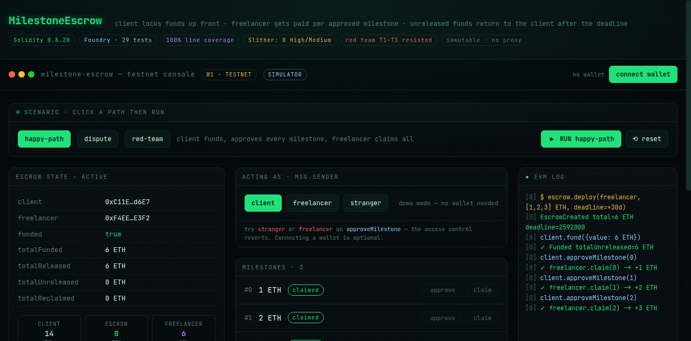

# MilestoneEscrow 🔒


<p align="center">
  
</p>

**On-chain milestone escrow for freelance/client work.** A client locks the full
contract value up front; funds release to the freelancer milestone by milestone as
each is approved. If the deadline passes with work unreleased, the client reclaims
the rest.

> Built end-to-end with a **security-first SOP** (tier W1, testnet): threat model →
> invariants → TDD → fuzz → static analysis → invariant testing → **red team**.
> Two real accounting bugs were found by the invariant gate before deploy.

## How it works
```
client.createEscrow(freelancer, [1 ETH, 2 ETH, 3 ETH], deadline)
client.fund()                       // locks exactly 6 ETH
client.approveMilestone(0)          // milestone 0 approved
freelancer.claim(0)                 // freelancer gets 1 ETH
...                                 // repeat per milestone
client.reclaimExpired()             // after deadline: reclaim the unreleased rest
```

## Guarantees (invariants)
1. `address(this).balance >= totalUnreleased` — always solvent
2. `totalReleased + totalUnreleased + totalReclaimed == totalFunded` — every wei accounted for once
3. `released[i] <= amounts[i]` — never over-release
4. one claim per milestone
5. only the client approves; only the freelancer claims
6. `totalReleased` is monotonic

## Security posture
- **Checks-effects-interactions** on every ETH transfer (+ explicit reentrancy tests).
- **Access control** on every privileged path, proven by revert tests.
- **Immutable** (no proxy/upgrade surface).
- **Stateful invariant tests** with handlers + Medusa-style bounded fuzzing.
- **Red team ladder** T1–T5 (see `SECURITY.md`).

## Run it
```bash
forge test                       # 29 tests
forge test --match-contract MilestoneEscrowInvariantTest   # stateful invariants
bash scripts/rehearse-deploy.sh  # local anvil deploy rehearsal
```

## Interactive demo (portfolio)
An Astro + React console lives in `app/` — a visitor can run the whole lifecycle
(happy-path / dispute / red-team) with no wallet, watch the invariants hold, and
see every call revert where access control bites. It is a faithful port of the
contract, covered by its own tests.

```bash
cd app && npm install && npm run dev   # http://localhost:4321
```



## Layout
```
src/MilestoneEscrow.sol        the contract
test/                          unit · branches · invariant · redteam
script/Deploy.s.sol            deploy script
app/                           Astro + React interactive console (portfolio)
scripts/rehearse-deploy.sh     E12 rehearsal (anvil)
docs/THREAT-MODEL.md           threat model (STRIDE + economic)
docs/SPEC.md                   EARS acceptance criteria
docs/SLITHER-TRIAGE.md         static-analysis triage
SECURITY.md                    gate results + known limits
HANDOFF.md                     frozen planning handoff (P7)
```

## Status
**W1 / testnet portfolio.** Not audited by a human, not for real funds. See `SECURITY.md`.