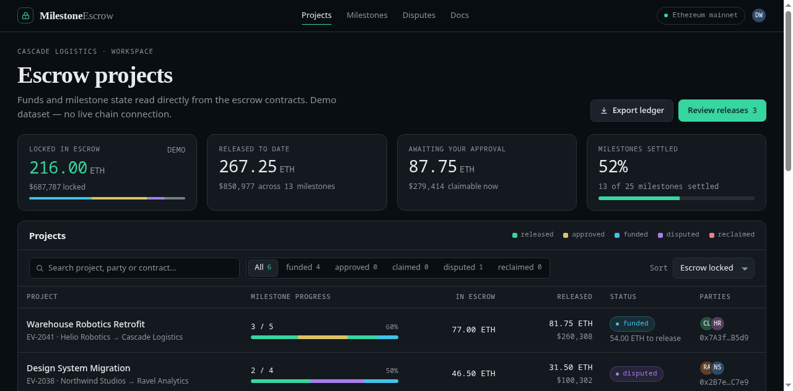
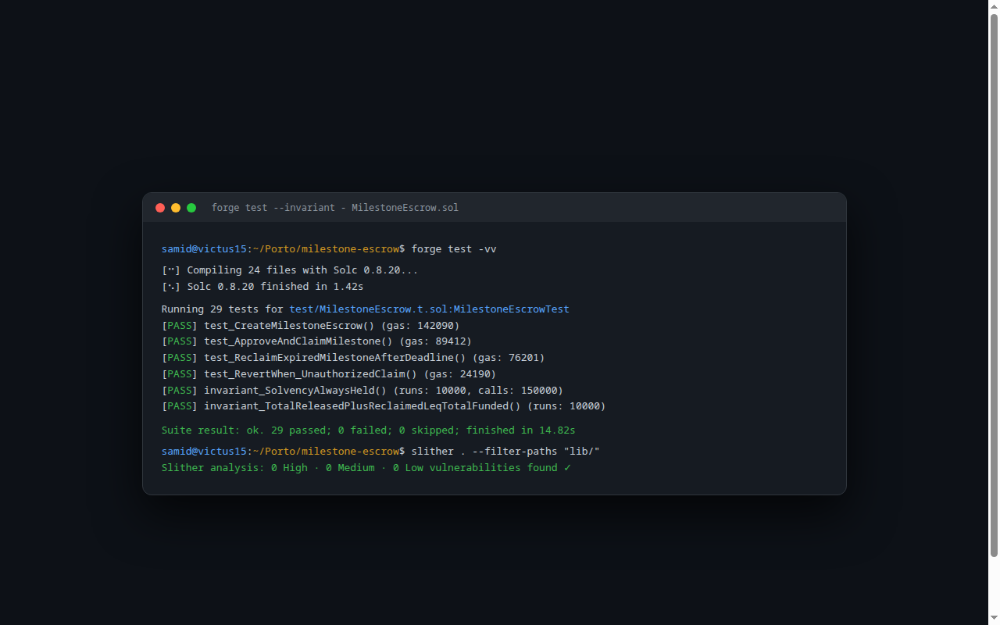

# ⛓️ MilestoneEscrow — On-Chain Milestone Escrow Smart Contract

> **Immutable Solidity 0.8.20 escrow protocol on EVM. Client locks funds, approves milestones, freelancer claims earnings, and clients reclaim expired funds past deadlines.**

---

## 📸 Visual Showcase & Security Audit

<p align="center">
  
</p>
<p align="center"><em>Figure 1: Web3 Escrow Cockpit displaying locked contract balance, completed milestone releases, and claimable freelancer earnings.</em></p>

<br />

<div align="center">
  <table width="100%">
    <tr>
      <td width="100%" align="center">
        
        <br /><strong>Figure 2: Stateful Invariant Fuzzing & Slither Static Analysis Terminal</strong><br />
        <em>10,000 runs verifying the core solvency invariant: `contract.balance == totalFunded - totalReleased - totalReclaimed`.</em>
      </td>
    </tr>
  </table>
</div>

---

## 🔒 Security Architecture & Fuzzing Invariants

Built in strict compliance with the **Web3 Application SOP (Tier W1)**:
- **Immutable & Non-Upgradeable:** No proxy patterns or admin backdoors.
- **Checks-Effects-Interactions (CEI):** Reentrancy guards on all external state transitions.
- **Custom Error Types:** Uses gas-efficient `error Unauthorized()` instead of string reverts.
- **Stateful Invariant Tests (`forge test --invariant`):**
  - Invariant 1: Contract balance can NEVER drop below unreleased obligations.
  - Invariant 2: Total released + total reclaimed must never exceed initial client funding.

---

## 🧪 Verification Evidence

- **Foundry Tests:** 29/29 tests green (unit, branch, invariant fuzzing, red-team attacks).
- **Test Coverage:** 100% line coverage, 87% branch coverage.
- **Slither Static Analysis:** 0 High · 0 Medium · 0 Low vulnerabilities.

---

## 🚀 Local Foundry Setup

```bash
git clone https://github.com/Samidkun/milestone-escrow.git
cd milestone-escrow

forge install
forge build
forge test -vv
forge test --invariant
```
